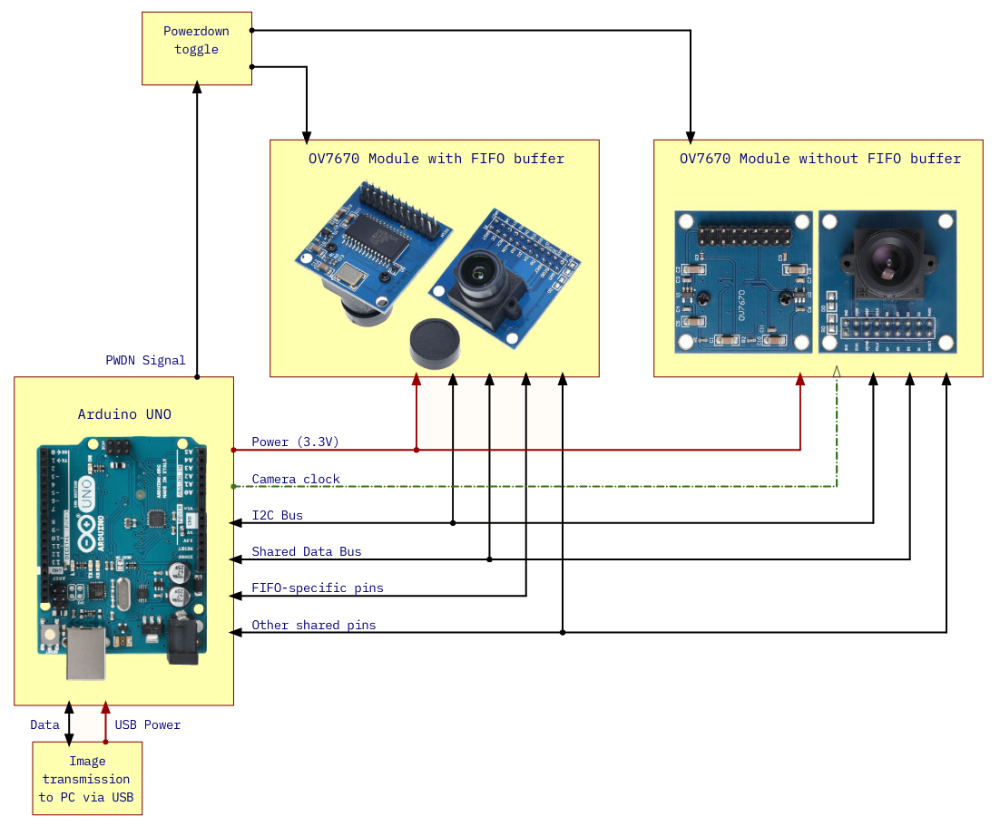
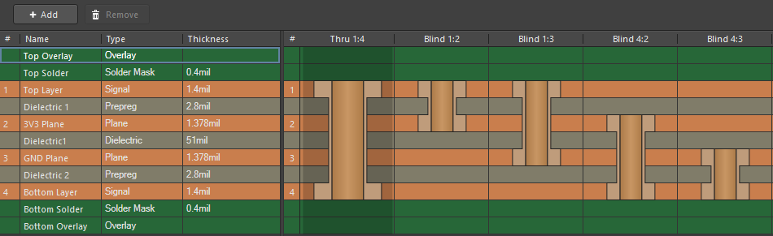
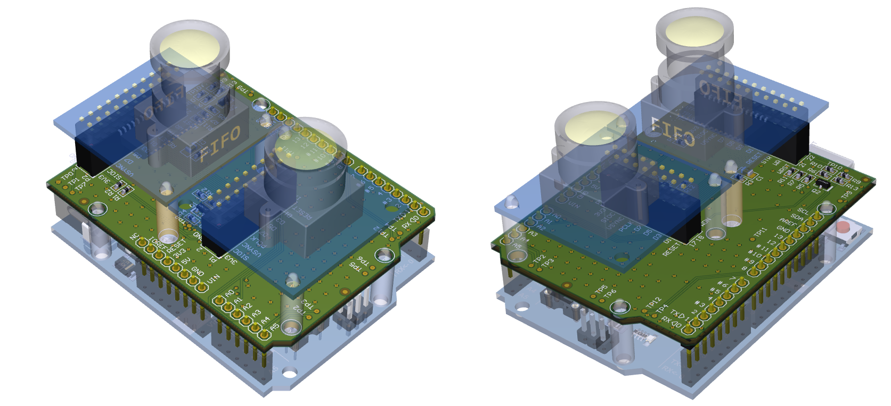
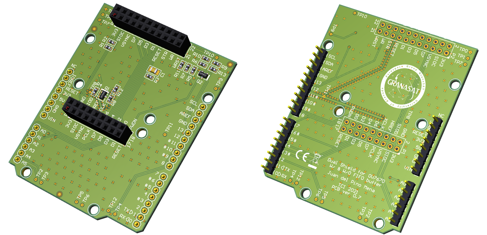
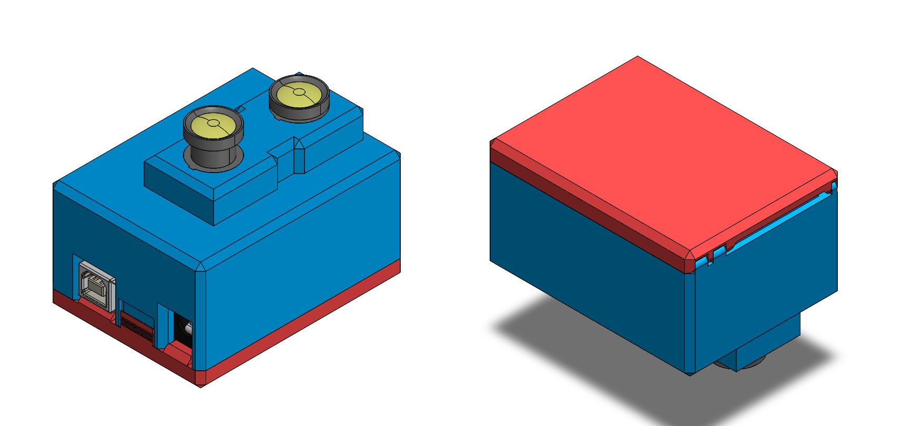
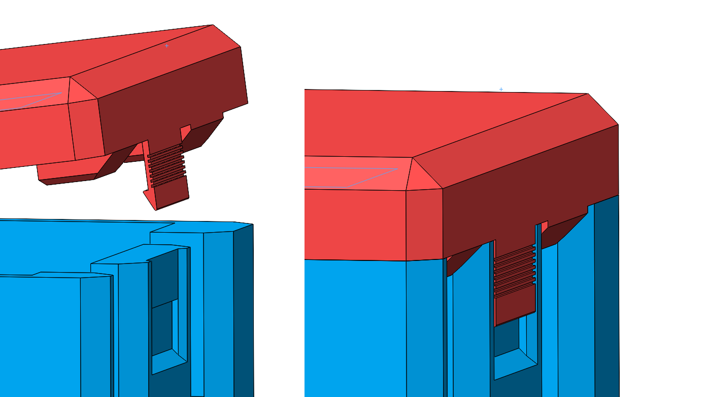
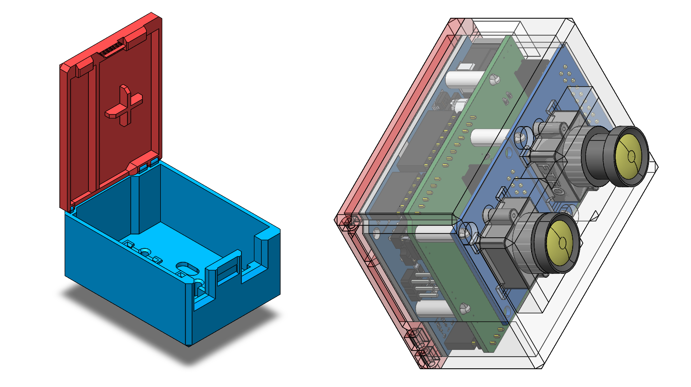
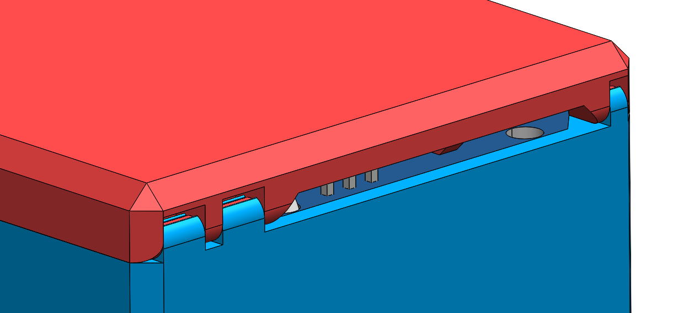

# Dual OV7670 Shield PCB for Arduino UNO 

This is an Arduino UNO shield that can contain up to two OV7670 camera modules in a single board, one with a FIFO Buffer and the other lacking it. Both cameras can't work at the same time as UNO's I/O is very limited so both modules share the data bus and other pins, and we toggle their shutdown state by using a NMOS inverter controlled by a digital pin. This project contains only PCB and Case design files and does not provide an Arduino code.

This project has been developed as part of Printed Circuit Technology (TCI), a subject taught in Telecommunications Engineering Degree in the University of Granada.

### Contents

This README contains the following documentation (in spanish):

1. Altium Designer PCB design notes 
2. SolidWorks Case design notes
3. Changelog
4. References

You will find a detailed circuit and PCB documentation on the attached PDF in this repository.

### License

This project is licensed under the MIT license and can be used freely. All product names, logos, and brands are property of their respective owners.
This project uses 3D models from 3dcontentcentral.com uploaded by users and companies and can be under other copyright licenses. All third-party assets are property of their respective owners. 

## PCB design notes

La PCB contiene muchos elementos que no son extrictamente necesarios para que el circuito funcione, pero aumentan la calidad del diseño:

- La PCB tiene cuatro capas (top + bottom y 2 planos: 3V3 y masa). Esto facilita la distribución de la alimentación y reduce la EMI entre trazas y capas. El circuito es simple y con espacio de sobra para poder disminuir la PCB a solo 2 capas; lo que ahorra coste, pero empeora las prestaciones.
- Vía stitching en GND, cortocircuitando los polygon pours de tierra de la top, bottom y plano de masa. Esto conecta las islas de cobre aisladas, proporcionan una ruta de baja resistencia a GND para corrientes de retorno y proporciona alivio térmico (en menor medida, dado que el circuito no produce mucho calor).
- Blindaje con via shielding en las trazas de XCLK desde las capas top y bottom hasta el plano de masa, para evitar interferencias y mantener una buena integridad de la señal.
- Logotipos en la parte inferior: Granasat, Conformité Européenne (CE), ROHS y WEEE.
- 3 Mounting holes para arduino y 2 por cada módulo de cámara.
- 11 Test-Points repartidos por toda la PCB (se ha procurado que estén cerca de los bordes) tanto en la top como la bottom.
- 3 fiduciarios para fabricación automática, situados en bordes y separados entre sí.

### PCB layer stack

### PCB renders

## Case design Notes

Este proyecto también incluye el diseño de una caja para la electrónica en SolidWorks. De plástico ABS, imprimible en 3D y con un diseño sin tornillería. 
El diseño viene marcado por la peculiar forma de la placa de circuito impreso del Arduino UNO y la altura del stack de 3 PCBs separadas por espaciadores, así como el deseo de realizarla de dimensiones relativamente compactas. Se ha optado por un diseño libre de tornillos, lo que hace esta caja muy práctica de utilizar. El método de cerrado consiste en una bisagra integrada en ambas piezas, de forma que una sea el eje y otra la pinza (de esta forma no se necesita una tercera pieza como eje).

La tapa se asegura a la base mediante una pestaña con estrías que la dotan de flexibilidad, de forma que vence el montículo y se encaja en su zócalo. Se ofrece margen debajo para poder hacer palanca sobre la pestaña y abrir la caja con facilidad. Los puertos están dotados de aperturas amplias.

Las piezas en sí mismas tienen formas determinadas para adaptarse a las formas de los componentes. En particular, la cubierta mayor contiene unos zócalos en los que encajan perfectamente con la forma de los móculos de cámaras, así como huecos con espacio suficiente para acomodar los espaciadores de las PCBs, ya sean los de Nylon elegidos u otros (como por ejemplo de tornillo).

La tapa cierra la caja y ofrece sujección por la parte de abajo del stack de placas mediante el nervio longitudinal que lo atraviesa, y la cruz al lado. Estos elementos están colocados de forma que no coinciden con ninguna soldadura o pin THT del Arduino. La tapa también contiene dos tacos que encajan en el hueco de los conectores. La bisagra de la esquina está integrada en la propia pieza de la tapa. El corte trapezoidal en el lado de la bisagra evita que la tapa colisione con la PCB al girar. La bisagra está integrada dentro del perfil de la caja, de forma que no sobresale del cuerpo.

---

## Changelog

- **Revisión 0.8 - 17/01/22**
    - CAMBIOS EN EL ESQUEMÁTICO
        - Añadida página 0 como introducción.
            - Contiene un diagrama de bloques explicativo del circuito.

    - CAMBIOS EN LA PCB:
        - Se añaden medidas
        - Títulos en las hojas de PCB al exportar a PDF
        - Modo de conexión de los polígonos con las vías cambiado de "relief" a "direct" - Elimina muchos errores de thermal relief en DRC.
    
    - DISEÑO DE LA CAJA:
        - Caja con forma sencilla, de material plástico ABS.
        - Diseño sin tornillos:
        - Dimensiones justas para la PCB y arduino UNO.
        - Bisagra para cerrar la tapa.
        - Ajuste de las cámaras en zócalos.
        - Pestaña flexible, con estrías, que encaja las dos piezas de la caja, dejando la tapa cerrada.
    
    - OTROS         
        - Inclusión del bill of materials
        <!-- - Se genera información de fabricación -->

- **Revisión 0.7 - 05/01/22**
    - CAMBIOS EN LA PCB:
        - Añadido de dos capas adicionales intermedias a la PCB como GND Plane y 3V3 Plane (4 capas en total). Esto aproxima la PCB como una línea microstrip a ojo de las trazas de alta velocidad, en especial atención requiere la línea del reloj.
        - Se acorta la traza del reloj lo máximo posible.
        - Se ensancha la traza del reloj de 10 mil a 20 mil para reducir su resistencia.
        - Aumentado el grosor de las trazas de alimentación de 3.3 V a 20 mil.
        - Se indica en el esquemático la forma de sustituir el transistor Q1 por un divisor resistivo de 5V a 3V.
        - Agrandados los pads G y D del Q1 para facilitar soldar en su lugar una resistencia de 0 Ohmios de tamaño 0603.
        - Se incluyen logos en la parte inferior de la placa.
        - Se añaden múltiples tests points.
        - Se añaden 3 fiduciarios en la top layer.
        - Se añade via stitching. Repartido por la superficie libre (cada 125 mil), para reducir la resistencia de las trazas de masa, acortar los caminos de retorno de corriente, conectar islas de los poligon pour aisladas, y en menor medida, por alivio térmico.
        - Blindaje del reloj XCLK. Se añade via shielding a las diferentes trazas del reloj (cada 15 mil), entre la bottom layer y el plano de GND; y entre la top layer y el plano de GND.
    
    - CAMBIOS EN LOS MODELOS 3D:
        - Se incluyen dos spacers de Nylon de 12 mm, M3, para cada módulo OV7670. El espacio es muy justo. Los espaciadores de latón (brass) estándares con rosca M3 colisionan entre ellos al ser más anchos, así como sus tornillos y tuercas. El nylon no es conductor, ni daña a la PCB al roscarlo dado que las perforaciones no están recubiertas (plated) ni tienen head landing. Otra opción es usar de plástico. Por otra parte los spacers de nylon no requieren de tornillos ni tuercas, simplemente se encajan.
        - Se indica claramente qué cámara es FIFO en el modelo 3D.
        - Una de las cámaras se mantiene extendida y la otra retraída.
        - Adición del modelo de un arduino UNO al footprint del mismo, así como spacers de nylon de la misma dimensión que los usados en los módulos de cámara.
    
    - OTROS:
        - Se realiza una copia de seguridad de la versión 06 dado que su diseño de sólo dos capas puede ser ventajoso. Es más barato y sencillo de fabricar, y puede desarrollarse otra rama de desarrollo, otra placa distinta a partir de esa revisión.
    
- **Revisión 0.6 - 15/12/21**
    - Ajustes en la posición de los componentes SMD y de las cámaras para cuadrar perfectamente con las dimensiones del Arduino NANO.
    - Borrado de las trazas y uso de ruteo manual.
    - Perforaciones para los spacers de las cámaras colocadas correctamente.
        - Inclusión de keepout zones cerca del borde de los mounting holes para eviar cortocircuitos.
    - Dimensiones y perforaciones de las cámaras ahora son correctas en cada caso.
    - Corrección: ahora los pines A4/A5 y SDA/SCL son identificados como la misma net.
    - Ajustado de las Design Rules para seguir las indicaciones de jlcpcb.com.
    - Reducido el tamaño de los textos a 40 mil, con grosor 6 mil.
    - Adición de poligon pours conectadas a GND para la bottom y top layer.
    
- **Revisión 0.5 - 07/12/21**
    - Recolocado de las cámaras.
    - Recolocado de los componentes.
    - Arreglado un bug con los modelos 3D de las resistencias.
    - Inclusión de taladros dentro del footprint de las cámaras.
    - Diferenciación entre los modelos de las cámaras FIFO y NO FIFO por un integrado.
    - Grosor de la PCB de 1.6 mm, FR4, 1oz/ft^2 por layer.
    - Reposicionado de todos los componentes para reducir la complejidad del ruteo.
    - Autorouter + Ruteo manual para reducir el número de vias.
    - Inclusión de imágenes y explicaciones en notas dentro de los esquemáticos.
    - Bus de datos de las líneas D0..D7.
    - Separación de los esquemáticos en dos hojas:
        - arduino_connections: Presentación del proyecto. Conexiones del Arduino UNO con el resto de componentes.
        - OV7670_headers: Conexión de los pines de los headers. Divisores resistivos y conversión de voltaje.
        
- **Revisión 0.4 - 30/11/21.**
    - Terminada la PCB con autorouter.
    - Revisión del esquemático.
    - Revisión de los footprints.
    - Uso de las plantillas de GranaSat para Schematic y para PCB.
    
- **Revisión 0.3 - 06/11/21**
    - Primera PCB en Altium
    - Cambiado el valor de muchas resistencias: 
        - Las anteriores superaban el valor de corriente por pin recomendado de 20 mA en los divisores de tensión.
        - Reducido del valor de las resistencias de pull-up del I2C.
    - Añadido condensador para garantizar estabilidad en el reset 
    
- **Revisión 0.2 - 24/10/21**
    - Modelo "dual" con dos cámaras
    - Esquemático Altium
    
- **Revisión 0.1 - 02/10/21**
    - Comienzo del registro en Jupyter. 
    - Modelo "single" con una cámara cada vez
    - Modelo prototipo de carcasa SolidWorks en forma de cámara de mano.
    - Bocetado general
    
# References

1. “Beggining Arduino OV7670 Camera Development”. Robert Chin, 2015
2. Pinout del módulo OV7670
    - https://embeddedprogrammer.blogspot.com/2012/07/hacking-ov7670-camera-module-sccb-cheat.html
3. Pinout del Arduino UNO Rev 3. BQ 4. 
    -  https://www.rpg.fi/desaster/blog/ov7670-camera-sensor-success.html
5. “How To Interface the OV7670 Camera Module With Arduino.” OV7670 SIN FIFO. Conexiones. 
    - https://maker.pro/arduino/tutorial/how-to-interface-the-ov7670-camera-module-with-arduino
6. https://github.com/desaster/ov7670fifotest
7. https://github.com/arndtjenssen/ov7670
8. https://github.com/dalmirdasilva/ArduinoCamera/blob/master/Documentation.pdf
9. OV7670 FIFO Arduino UNO. Conexiones. 
    - https://thinksmallthings.wordpress.com/2015/01/06/arduino-uno-ov7670-fifo-module-schematic/comment-page-1/
10. “Arduvision (II): OV7670 + FIFO module and arduino Mega” David Sanz Kirbis. OV7670 FIFO Arduino Mega. Conexiones. Consideraciones de conversión de voltaje. 
    - https://www.therandomlab.com/2016/06/arduvision-ii-ov7670-fifo-module-and.html
11. “Arduvision (I): embedded computer vision with arduino.” David Sanz Kirbis. OV7670 FIFO Arduino Nano 3v3. Conexiones. 
    - https://www.therandomlab.com/2014/09/arduvision-i-embedded-computer-vision.html
12. “Bi-Directional Logic Level Converter”. Patrick Alberts. SparkFun. 
    - https://github.com/sparkfun/Logic_Level_Bidirectional
    - https://cdn.sparkfun.com/datasheets/BreakoutBoards/Logic_Level_Bidirectional.pdf
    - https://electronics.stackexchange.com/questions/329969/logic-level-translator-operation

